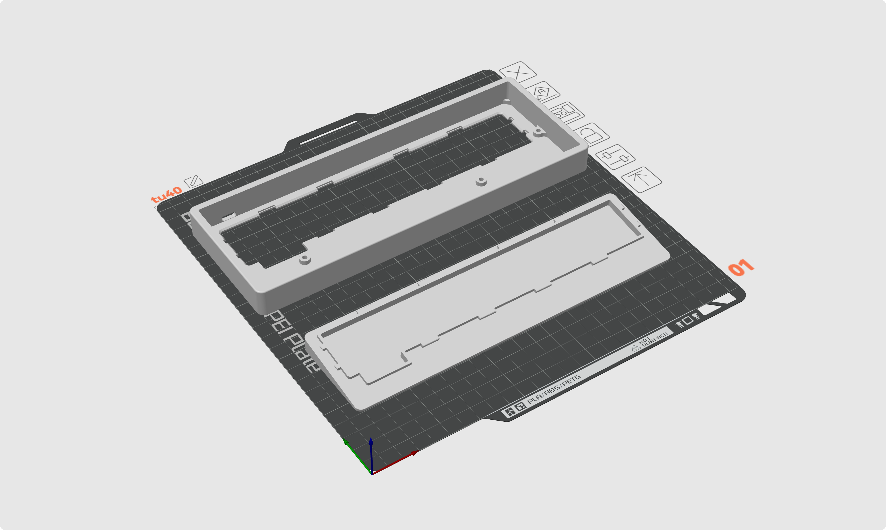

# TU40 客制化键盘外壳

TU40 键盘外壳 3D 打印文件及设计源文件

## 📦 3D 打印文件下载

可直接用于 3D 打印的文件（3MF 格式）：

- [TU40 左侧 Type-C 版本](./3d_printing/tu40_left_typec.3mf)
- [TU40 中间 Type-C 版本](./3d_printing/tu40_mid_typec.3mf)

## 📐 设计图纸源文件下载

设计源文件（STEP 格式），可用于修改和定制：

- [TU40 左侧 Type-C 版本源文件](./source_file/tu40_left_typec.step)

## 🤝 参与贡献

欢迎大家一起参与改进这个项目！

### 如何参与

1. **Fork** 本仓库
2. 创建你的特性分支 (`git checkout -b feature/AmazingFeature`)
3. 提交你的更改 (`git commit -m 'Add some AmazingFeature'`)
4. 推送到分支 (`git push origin feature/AmazingFeature`)
5. 开启一个 **Pull Request**

### 贡献方向

- 🐛 修复问题或 Bug
- ✨ 添加新功能或改进设计
- 📝 改进文档
- 🎨 优化设计细节
- 🔧 添加新的外壳变体

### 反馈与建议

如果你有任何问题、建议或想法，欢迎：
- 提交 [Issue](../../issues)
- 发起 [Pull Request](../../pulls)
- 在 Discussions 中讨论

让我们一起让这个项目变得更好！

## 📄 许可证

本项目采用 [MIT License](./LICENSE) 许可证。
